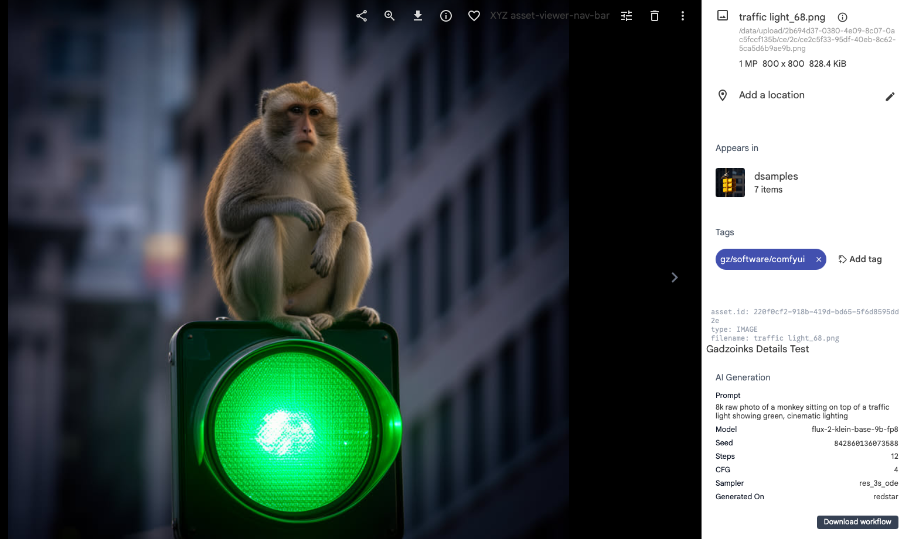
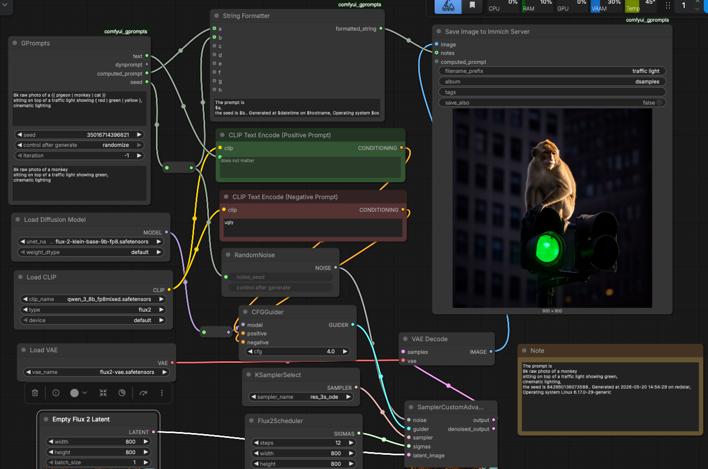

# Gadzoinks — ComfyUI × Immich Metadata Bridge

A set of custom ComfyUI nodes and Immich patches. A ComfyUI node saves images directly into Immich. With the Immich patches applied, generation metadata is stored in the Immich DB and surfaces in the asset viewer — displayed and searchable.

---

## What it does

Images generated in ComfyUI are uploaded directly to Immich.
On a patched Immich instance, the full generation metadata — prompt, model, seed, sampler, steps, CFG, LoRA — is stored in the database, shown in the asset viewer, and available as search filters.

**Pipeline:**

```
Comfyui + comfyui_gprompts [custom node pack]  → Save to Immich node -> Immich server
```
If you have a normal unpatched Immich server then image is uploaded with optional tags and album.
If you have a patched Immich server then the image metadata is stored in the DB and can be displayed and used for searching.


---

## Custom Nodes — comfyui_gprompts

Install via **ComfyUI Manager**, or manually from:

- Registry: https://registry.comfy.org/nodes/gprompts
- GitHub: https://github.com/GadzoinksOfficial/comfyui_gprompts

The `comfyui_gprompts` node pack contains a few helpful nodes along with save to immich server. gprompts is a powerful prompt expansion tool, and string formatter let you build strings from multiple sources and system variables (date, hostname,OS name...a)

---

## Vanilla vs Patched Immich

| Feature                        | Standard Immich | Gadzoinks Immich |
|------------------------------- |:-:|:-:|
| Image saved to library         | ✓ | ✓ |
| Album assignment               | ✓ | ✓ |
| Tags applied                   | ✓ | ✓ |
| Prompt and gen data stored     | ✗ | ✓ |
| Model / lora stored            | ✗ | ✓ |
| AI Generation panel in viewer  | ✗ | ✓ |
| Download Workflow button       | ✗ | ✓ |
| Search by prompt, model, LoRA  | ✗ | ✓ |

---

## Asset Viewer — Metadata Panel


---

## Search — AI Generation Filters

Immich search extended with AI Generation fields: prompt text, architecture, model, and LoRA.



---

## System Architecture

```
┌─────────────────────────────────────────────────────┐
│  ComfyUI                                            │
│  ┌─────────────────────────────────────────────┐    │
│  │  comfyui_gprompts node pack                 │    │
│  │  GPrompts · String Formatter· Save to Immich│    │
│  └─────────────────────────────────────────────┘    │
└───────────────────────┬─────────────────────────────┘
                        │ HTTP to Immich host
                        ▼
┌─────────────────────────────────────────────────────┐
│  Caddy (reverse proxy)                              │
│  /gz/*  ──────────────────► Gadzoinks server        │
│  everything else  ────────► Immich (unchanged)      │
└───────┬───────────────────────────────┬─────────────┘
        │ /gz REST calls                │ standard Immich API
        ▼                               ▼
┌───────────────────┐        ┌──────────────────────┐
│  Gadzoinks server │        │  Immich              │
│  (Docker)         │        │  (Docker, unmodified)│
│  FastAPI          │        └──────────────────────┘
│  metadata ingest  │
│  XMP sidecar      │
└───────┬───────────┘
        │ SQL write
        ▼
┌─────────────────────────────────────────────────────┐
│  Postgres                                           │
│  assets (Immich)  ·  gz_generation_metadata         │
└───────────────────────┬─────────────────────────────┘
                        │ read on panel open
                        ▼
┌─────────────────────────────────────────────────────┐
│  Immich Web (patched frontend)                      │
│  Asset Viewer  ·  Searching  ·  AI Generation panel │
│  Download Workflow button                           │
└─────────────────────────────────────────────────────┘
```


---

## Components

### docker-compose.gz.yml
- Adds the Gadzoinks FastAPI server as a Docker service alongside the Immich stack
- Shares the Immich Postgres instance; mounts the Immich upload volume for sidecar writing
- Adds Caddy as the reverse proxy service

### Caddyfile
- `/gz/*` routed to the Gadzoinks FastAPI server container
- All other requests forwarded to the standard Immich server unchanged

### gz-server/main.py
- FastAPI app handling `POST /gz/metadata` — receives and stores generation metadata
- Writes metadata to a dedicated Postgres table keyed by Immich asset ID
- Writes XMP sidecar file into the Immich upload directory for the asset

### gz-server/schema.sql
- Postgres table `gz_generation_metadata` linked to Immich `assets` by asset ID
- Columns: `prompt`, `model`, `seed`, `steps`, `cfg`, `sampler`, `generated_on`, `workflow_json`

### immich-patch/AIGenerationDetail.svelte
- New Svelte component added to the Immich asset detail panel
- Fetches metadata from `GET /gz/metadata/:assetId` and renders it in the viewer
- "Download Workflow" button — retrieves and downloads the stored workflow JSON
- Only rendered when a metadata record exists for the asset

---

## License

GNU General Public License v3.0 — see [LICENSE](LICENSE)

---

## Install notes
```
curl -fsSL https://get.docker.com | sh
sudo usermod -aG docker $USER
newgrp docker

sudo mkdir /opt/library
sudo chown $USER:$USER /opt/library/
git clone https://github.com/neal3000/immich_gadzoinks.git immich-dev
cd immich-dev
git checkout immich_gadzoinks

edit these values , is DB_DATA_LOCATION used ?
UPLOAD_LOCATION=/opt/library
DB_DATA_LOCATION=/opt/postgres
vi docker/.env


cd docker/
docker compose -f docker-compose.dev.yml up immich-server immich-web database redis -d
docker compose -f docker-compose.dev.yml logs -f


test with web server http://localhost:3000
create account, create an API key ( and save it for later )
in account settings. Star Rating, Enable. Tags, enable.
click save

sudo apt install -y caddy
sudo tee /etc/caddy/Caddyfile << 'EOF'
:2281 {
    handle /gz/* {
        reverse_proxy localhost:2289
    }
    handle {
        reverse_proxy localhost:3000
    }
}
EOF

sudo systemctl restart caddy
sudo systemctl enable caddy

docker compose -f docker-compose.dev.yml up -d gadzoinks
cd ~/immich-dev
make dev

test with web server http://localhost:2281
test with comfyui
install comfyui_gprompts ( you can use comfyui mananger (--enable-manager) , or install into custom_nodes folder )
open comfyui settings, select 'Gadzoinks' enter api key , hostname and port
use 'Save Image to Immich' node , instead of 'Save Image'
```
